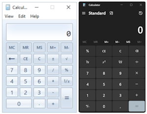

# Simple bot to demostrate Windows desktop automation options.

The robot implements a simple addition on Windows Calculator with different methods:
1. Using keyboard actions is fast and stable, provided the target application provides hot-keys
2. Using the locators enables you to target the UI element tree values
   - See [Robocorp Inspector](https://robocorp.com/docs/developer-tools/visual-studio-code/locators)
3. Using image-based locators is the slowest and most brittle, but still sometimes needed
   - Depends a lot on resolution, colors, font
   - As an example Windows Calculator can look quite different in different cases.
     

The run `log.html` shows the performance differences

